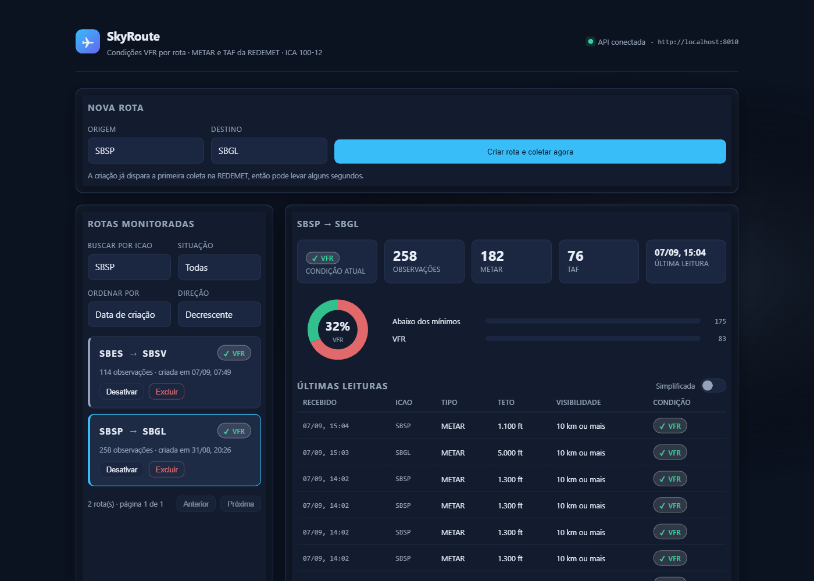

# SkyRoute — Interface (Front-end)

Interface do **SkyRoute**, sistema de acompanhamento meteorológico para aviação. A partir das
mensagens **METAR (Observação)** e **TAF (Previsão)** da [REDEMET](https://api-redemet.decea.mil.br) (DECEA),
fonte oficial da autoridade aeronáutica brasileira, o SkyRoute classifica a condição operacional
dos aeródromos de origem e destino de cada rota segundo os mínimos VMC da **ICA 100-12
(Art. 104, Tabela 1)** e mostra o resultado neste painel.

A pergunta que o sistema responde é simples: **As condições nos aeródromos desta rota estão dentro dos mínimos para voo VFR?**

> Este repositório contém a **interface**. Ela consome a API do repositório
> **[Minha-API-MVP-IV](https://github.com/digofd/Minha-API-MVP-IV)**



---

## Sumário

- [Arquitetura](#arquitetura)
- [Instalação e execução](#instalação-e-execução)
- [A interface](#a-interface)
- [Quando a interface chama a API](#quando-a-interface-chama-a-api)
- [Estrutura do repositório](#estrutura-do-repositório)

---

## Arquitetura

Segue o **Cenário 1.1** como base mínima exigida no MVP: interface → API → banco, com a API consumindo duas API externas.
Cada componente roda em seu próprio container, e cada um dos dois componentes implementados tem seu próprio repositório.


| Componente | Tecnologia | Porta no host | Repositório |
|---|---|---|---|
| **Interface** | React 18 + Vite, servida por nginx | `8020` | este |
| **API** | FastAPI + SQLAlchemy assíncrono + APScheduler | `8010` | [Minha-API-MVP-IV](https://github.com/digofd/Minha-API-MVP-IV) |
| **Banco operacional** | PostgreSQL 14 | `5433` | Minha-API-MVP-IV |
| **Banco de histórico** | PostgreSQL 14 — 15 dias de série | `5434` | Minha-API-MVP-IV |
| **API Externas** | REDEMET e AISWEB / DECEA | — | consumidos pela API |

**Comunicação:** a interface fala **somente com a API do SkyRoute**, por REST com JSON sobre HTTP
(`GET`, `POST`, `PUT`, `DELETE`). Ela não chama a REDEMET nem a AISWEB diretamente, e as chaves
dessas APIs ficam só no back-end. Como quem faz a chamada é o **navegador** do usuário (não o
container do nginx), a URL da API é a publicada no host, `http://localhost:8010`, e a API libera
CORS para a origem da interface.

A interface segue a mesma separação da API: `src/core/` tem funções puras (formatação,
tradução de status, geometria dos gráficos) e `src/api.js` concentra todo o IO.
Após a aula do Professor Otávio Lemos, no dia 25/08/2026, com a apresentação do vídeo do youtube
"Moving IO to the edges of your app: Functional Core, Imperative Shell - Scott Wlaschin",
resolvi me aprofundar no tema Núcleo Funcional e Casca Imperativa, pois achei o método espetacular.
Desta forma, meu desenvolvimento do Projeto de MVP Skyroute, tem a API organizada como 
**Functional Core, Imperative Shell**, onde toda decisão de negócio mora em funções puras e todo IO nas bordas,
com testes de unidade para as regras de negócio, sem misturar entradas e saídas com elas.

---

## Instalação e execução

### Pré-requisitos

- **Docker Desktop** com Docker Compose v2
- **API do SkyRoute** em <http://localhost:8010> — siga o README do
  [Minha-API-MVP-IV](https://github.com/digofd/Minha-API-MVP-IV)
- Para desenvolvimento fora do container: **Node**

### 1. Subir a interface

```bash
git clone https://github.com/digofd/Meu-Front-MVP-IV.git
cd Meu-Front-MVP-IV
docker compose up -d --build
```

O `Dockerfile` tem dois estágios: o primeiro gera o bundle com o Vite, o segundo serve os
arquivos estáticos com nginx. O container tem ainda o *healthcheck*.

| Serviço | URL |
|---|---|
| Interface | <http://localhost:8020> |

O indicador no cabeçalho mostra **"API conectada"** quando a API responde em `/health`.

### 2. Apontar para outra API (opcional)

A URL da API entra no bundle **em tempo de build**. Para usar outro endereço, altere
`VITE_API_URL` em `docker-compose.yml` e reconstrua com `docker compose up -d --build`.

### Desenvolvimento local (sem container)

```bash
npm install
npm run dev
# http://localhost:5173
```

Se desejar apontar a interface a outra API, defina a variável antes: `VITE_API_URL=http://localhost:8000 npm run dev`

Para conferir se o bundle compila: `npm run build`.

### Parar

```bash
docker compose down
```

---

## A interface

- **Painel com gráficos** — tipo rosca de proporção VFR e barras por condição, desenhados em SVG
  a partir de funções puras de geometria, sem biblioteca de gráficos.
- **Cartões de rota** com selo de condição, contagem de observações e ações diretas.
- **Filtro, ordenação e paginação** ligados aos parâmetros da API.
- **Retorno visual** — avisos temporários a cada ação, estado de carregamento, estados
  vazios que explicam o próximo passo, e confirmação antes de excluir.
- **Indicador de conexão** com a API no cabeçalho.
- **Tabela "Leituras das últimas 24h"**, com teto, visibilidade e condição (a base legal
  aparece ao passar o mouse em **hover**) e **Anterior/Próxima** para passar as janelas com INFO
  dos METAR e TAF juntos, buscados à parte em `GET /routes/{id}/observacoes`. Como o METAR chega 
  várias vezes por coleta contra 1 TAF, o TAF pode sumir da primera página, necessitando percorrer 
  a tabela caso precise olhar a mensagem.
- **Visualização simplificada ou completa** — há um botão de alternância no cabeçalho da tabela,
  a tabela abre no modo simplificado e o modo completo fica a um clique no toggle.
  No modo completo, cada leitura ganha a **mensagem METAR ou TAF original (raw)**, sem
  tradução, com um botão para copiá-la.
- **Aviso de TEMPO/PROB do TAF** — ícone ⚠ ao lado do selo quando o TAF tem um período
  temporário em vigor no recebimento, e o hover mostra o texto do período. Ele não muda a condição
  mostrada, mas apenas avisa.
- **Selo VFR Especial** — cor âmbar, com um hover do mouse ou teclado, explicando as duas condições do
  Art. 134 que o sistema não tem como confirmar por conta própria, que depende de autorização prévia
  do órgão ATC (controle ou torre) e de haver rádio VHF em operação. As outras duas condições exigidas, 
  que são de voo diurno e CTR/ATZ, é o que automatizei com as API AISWEB e REDEMET, e já ficam previamente
  confirmadas pelo app antes do selo aparecer.
- **Coleta do histórico em andamento** — ao selecionar uma rota recém-criada, o painel de
  tendência mostra uma barra dinâmica de progresso com a mensagem "Coletando dados no REDEMET..." 
  e atualiza sozinha assim que os dados chegam, sem precisar de F5.
- **Painel de tendência** — quatro gráficos, um por variável, cada um no eixo da sua unidade real
  (ft, m, °C, hPa) e com a variação do período no cabeçalho. Abaixo deles, **um gráfico combinado**:
  as quatro séries normalizadas na própria faixa, sobre um 
  **fundo pintado de acordo com a condição de voo do momento**, com a legenda das variáveis fora do 
  gráfico para não serem cortadas pelas linhas.
  A pergunta que o painel responde é: O que aconteceu com a condição quando as curvas se moveram?
  Pontos de SPECI (expeciais fora do horário cheio) são marcados com círculo, como extras, 
  e onde falta ponto leitura, a linha liga ao próximo ponto disponível, mas nenhum valor é interpolado, 
  por não ser um sistema discreto.
- **Acessibilidade** — `aria-live` nos avisos, rótulos associados aos campos, contraste alto e respeito a `prefers-reduced-motion`.

---

## Quando a interface chama a API

Todo `fetch` passa por `src/api.js`, e nenhum componente monta URL. Para acompanhar, pode abrir as
ferramentas do navegador (F12) na aba **Rede/Network**, filtrando por `8010`.

| Momento na tela | Chamada à API |
|---|---|
| Abrir a página | `GET /health` (indicador de conexão) e `GET /routes` com o filtro atual |
| Lista carregada | `GET /routes/{id}/resumo` para cada rota da página (selo de condição do cartão) |
| Mudar filtro, ordenação ou página da lista | `GET /routes?icao=…&ativa=…&ordenar_por=…&ordem=…&pagina=…` |
| Clicar numa rota | `GET /routes/{id}` e `GET /routes/{id}/resumo` (painel) |
| Tabela "Leituras das últimas 24h" | `GET /routes/{id}/observacoes?pagina=…&tamanho=10&horas=24`, e de novo a cada Anterior/Próxima |
| Painel de tendência | `GET /historico/rota/{id}?dias=15`; se ainda faltar dado recente, repete a cada 10 s (até 24 vezes) enquanto mostra "Coletando dados no REDEMET..." |
| Criar rota | `POST /routes`, depois recarrega a lista e seleciona a rota nova |
| Ativar/Desativar | `PUT /routes/{id}` com `{"ativa": true/false}`, depois recarrega a lista |
| Excluir (após confirmar no diálogo) | `DELETE /routes/{id}`, depois recarrega a lista |

---

## Estrutura do repositório

```
Meu-Front-MVP-IV/
├── docs/
│   ├── arquitetura.svg / .png      fluxograma da arquitetura
│   └── interface.png               captura da interface
├── Dockerfile                      build Vite + nginx, em dois estágios
├── docker-compose.yml              sobe a interface em localhost:8020
├── nginx.conf                      SPA e cache dos arquivos estáticos
├── index.html
├── package.json
├── vite.config.js
└── src/
    ├── core/                       funções puras de apresentação
    │   ├── grafico.js              geometria dos gráficos em SVG
    │   ├── serie.js                geometria das séries temporais da tendência
    │   └── status.js               tradução de status e formatação
    ├── components/                 formulário, lista, painel da rota, tendência, diálogos
    ├── api.js                      todo o IO do front
    ├── clipboard.js                cópia da mensagem METAR/TAF original
    ├── styles.css
    ├── main.jsx
    └── App.jsx                     casca: estado da tela e chamadas à API
```

---

## Créditos e fontes

- **Dados meteorológicos:** API REDEMET — Departamento de Controle do Espaço Aéreo (DECEA).
- **Nascer/pôr do sol e dados de aeródromo:** API AISWEB — Departamento de Controle do Espaço Aéreo.
- **Regra operacional:** ICA 100-12 — *Regras do Ar*, Art. 104 (Tabela 1, mínimos VMC) e
  Art. 134 (VFR Especial).
- **Arquitetura Functional Core, Imperative Shell:** baseada nas teorias e fundamentos de Scott Wlaschin no livro *Domain Modeling Made Functional* e de Mark Seemann no livro *Code That Fits in Your Head*.

# Desenvolvedor do Projeto

<br><sub>Rodrigo Domingues</sub>
(https://github.com/digofd)
